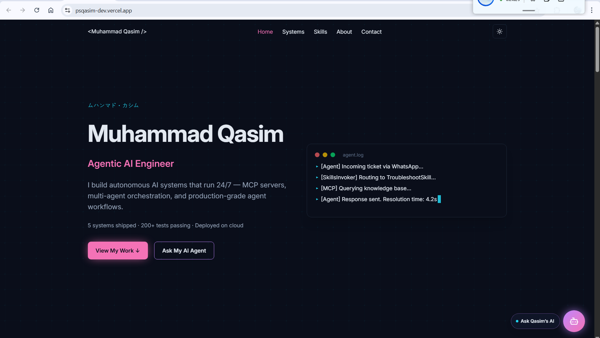

# Muhammad Qasim — Portfolio 2026

[](https://nextjs.org)
[](https://www.typescriptlang.org)
[](https://tailwindcss.com)
[](https://vercel.com)
[](LICENSE)



**Live site:** <https://psqasim-dev.vercel.app/>

## About

Personal portfolio for **Muhammad Qasim**, an Agentic AI Engineer based in
Karachi, Pakistan. Built with the *"Anime × Dark Tech × AI"* design theme —
dark navy backgrounds, sakura pink accents, Japanese kanji decorative
elements, and AI circuit-board motifs.

## Features

- 6 shipped AI system showcases with real metrics and live links
- Embedded AI chatbot powered by **OpenAI Agents SDK** (`gpt-4o-mini`) with
  tool-calling for grounded answers
- "Earlier Work" expandable section for older projects
- Dark / Light theme with polished design for both modes
- Mobile-first responsive design
- Japanese kanji section accents and anime-inspired aesthetics
- Contact form via Web3Forms
- JSON-LD structured data + `llms.txt` for AI-friendly SEO (LLMO)
- Session-scoped preloader with kanji animation

## Tech Stack

- **Framework:** Next.js 15 + App Router + TypeScript (strict)
- **Styling:** Tailwind CSS 4 + CSS custom properties
- **Animation:** Framer Motion (LazyMotion / `domAnimation`)
- **AI Chatbot:** OpenAI Agents SDK + `gpt-4o-mini`
- **Theme:** `next-themes` (dark / light)
- **Icons:** Lucide React
- **Contact:** Web3Forms
- **Deployment:** Vercel
- **Methodology:** Spec-Kit Plus (Spec-Driven Development)

## Architecture

```text
src/
├── app/             # Next.js App Router pages + API routes
│   └── api/chat/    # AI chatbot streaming endpoint (SSE)
├── components/
│   ├── chat/        # AI chatbot widget
│   ├── layout/      # Navbar, Footer, Preloader
│   ├── sections/    # Hero, Systems, TechStack, About, Contact
│   └── ui/          # Reusable components
├── data/            # TypeScript data files (systems, skills, personal)
├── lib/             # Utilities, chat agent, rate limiter
└── types/           # TypeScript interfaces
```

## Systems Showcased

1. **CRM Digital FTE** — 24/7 AI customer success agent (101 tests, 7 MCP tools)
2. **Personal AI Employee** — Autonomous task execution, Platinum tier (122 commits, 97% coverage)
3. **Physical AI Humanoid Textbook** — Open source AI education platform
4. **TaskFlow** — Cloud-native AI task manager on Kubernetes
5. **Factory-de-Odoo** — Architecture advisor for ERP generation framework (33,200+ lines)
6. **MCP-Native Developer Tool** — Multi-MCP orchestration (Cerebral Valley hackathon)

## Development

```bash
pnpm install
pnpm dev
```

Requires `.env.local`:

```env
NEXT_PUBLIC_WEB3FORMS_KEY=your-key
OPENAI_API_KEY=your-key
```

## License

[MIT](LICENSE)

## Author

**Muhammad Qasim** — Agentic AI Engineer

- GitHub: <https://github.com/Psqasim>
- LinkedIn: <https://linkedin.com/in/muhammadqasim-dev>
- X: <https://x.com/psqasim0>
